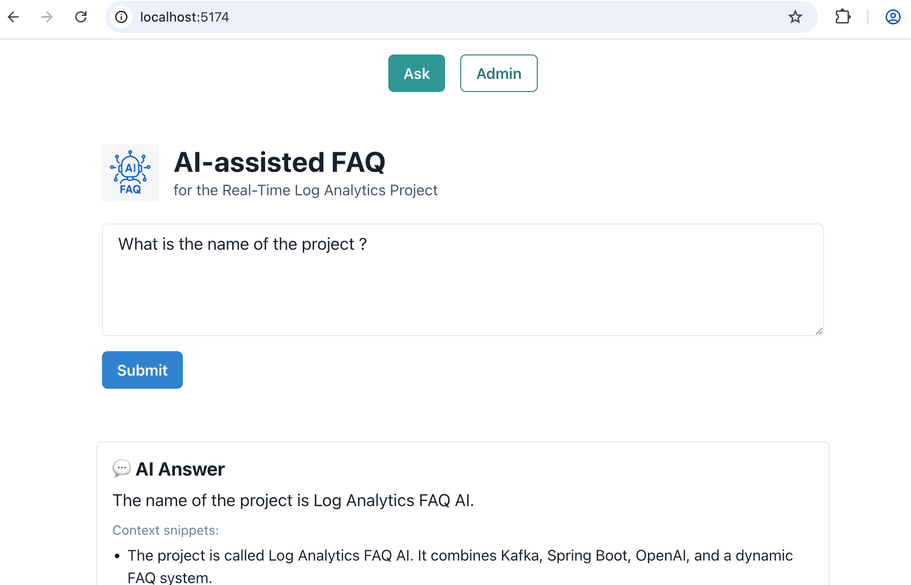
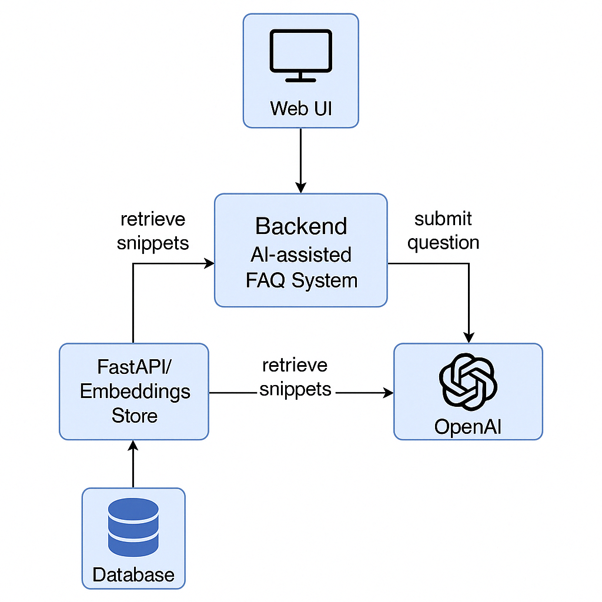

# 🧠 Log Analytics FAQ AI

This project is an AI-assisted FAQ interface tailored for the **Real-Time Log Analytics** system using Kafka, Spring
Boot, and Elasticsearch. It leverages OpenAI's GPT model and a local semantic search engine (FAISS) to answer user
questions in natural language.

---

## 🚀 Features

- **Ask the AI**: Users can submit questions about the project and get answers generated by OpenAI GPT.
- **Real-Time Snippet Retrieval**: Relevant validated Q&A snippets are retrieved using vector search with FAISS.
- **Admin Panel**: Allows validation and correction of AI-generated answers.
- **Persistent storage**: Questions and answers are stored in an H2 database.
- **Automatic index rebuilding**: On validation, the RAG index is automatically refreshed.
- **Beautiful frontend**: Built with React + Chakra UI.

---

## 📦 Technologies

| Layer     | Stack                                                      |
|-----------|------------------------------------------------------------|
| Backend   | Java 23, Spring Boot, H2, Spring Security, SpringDoc       |
| AI Engine | OpenAI GPT + Python FastAPI + FAISS + SentenceTransformers |
| Frontend  | React + Vite + TypeScript + Chakra UI                      |
| DevOps    | Docker (planned), GitHub Actions                           |

---

## ▶️ Getting Started

### 1. Clone the project

```bash
git clone https://github.com/lguberan/log-analytics-faq-ai.git
cd log-analytics-faq-ai
```

### 2. Prerequisites

- Java 23
- Python 3.9+
- Node.js 18+ (for frontend)
- OpenAI API Key, ${OPENAI_API_KEY} environment variable set

### 3. Run locally

#### ✅ Backend

```bash
./mvnw spring-boot:run
```

#### 🧠 RAG Microservice (Python)

```bash
cd rag-python
python3 -m venv .venv
source .venv/bin/activate
pip install -r requirements.txt
uvicorn main:app --reload --port 8001
```

#### 💻 Frontend

```bash
cd frontend
npm install
npm run dev
```

---

## 📘 API Endpoints

- `POST /api/faq/ask` → Ask a question
- `GET /api/admin/questions?validated=false` → Admin validation queue
- `POST /api/admin/questions/{id}/validate` → Validate or correct an answer
- `POST /rag/rebuild` → Rebuild vector index (automatically called on validation)

---

## Frontend UI



---

## 📂 Project Structure

```
log-analytics-faq-ai/
├── frontend/          # React + Chakra UI
├── rag-python/        # FastAPI RAG microservice
├── src/main/java/     # Spring Boot backend
├── data/              # H2 persistent DB + faiss index
```

---

## Architecture



---

## 🔒 Security

- Only authenticated users with role `ADMIN` can access the validation endpoints (user:admin, password:secret).
- CSRF and HTTP Basic are enabled for backend.

---

