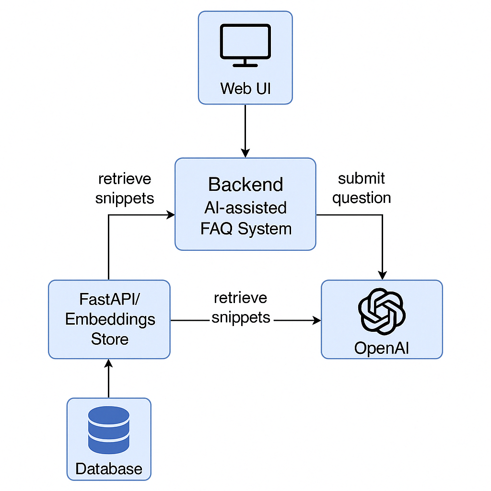
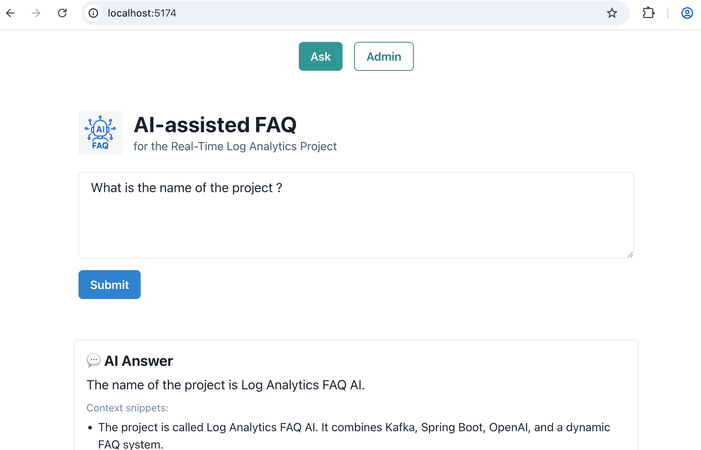
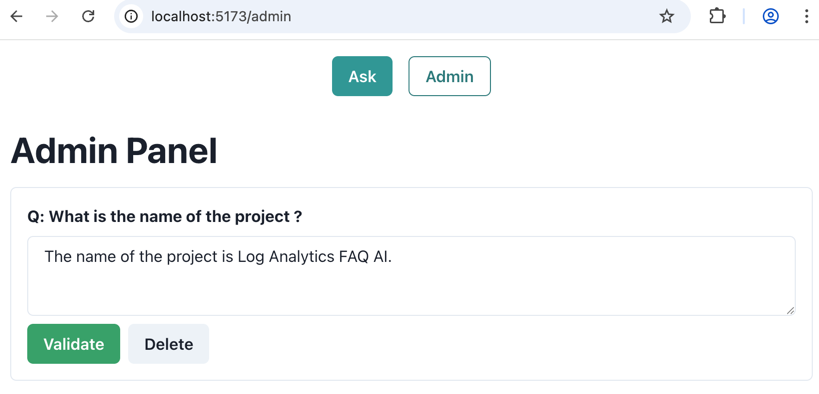

# 🧠 AI-assisted FAQ for Real-Time Log Analytics

A full-stack project that answers user questions using a LLM-powered FAQ system.

This project integrates a **Retrieval-Augmented Generation** (RAG) system that enhances user questions with validated
FAQ
answers. The AI assistant uses semantic similarity (via vector embeddings and FAISS) to retrieve the most relevant
existing answers as contextual “snippets” before generating a new response.

- ✅ The assistant doesn’t answer from scratch — it uses your validated answers as trusted sources.
- ✅ This ensures more accurate and relevant responses tailored to your project.
- ✅ Powered by OpenAI, FAISS (vector search), and Spring Boot + FastAPI integration.

---

## 🖼️ Architecture



This project integrates:

- A **Spring Boot backend** exposing REST endpoints and securing admin actions.
- A **Python microservice** using **FAISS** and **sentence-transformers** for intelligent snippet retrieval (RAG).
- A **React + Chakra UI frontend** with an intuitive interface.
- A **Kafka pipeline** (simulated or real) to handle logs and feed the analytics.
- **H2** persistent storage for validated questions and answers.

---

## ✅ Features

- Natural language question processing
- RAG (Retrieval Augmented Generation) using OpenAI
- Admin panel to validate or correct answers
- Persistent H2 database
- Automatic FAISS index rebuild on validation
- Beautiful React frontend with Chakra UI
- Swagger UI for REST exploration

---

## 🚀 Install

Make sure you have:

- Java 23
- Python 3.9+ (with `venv`)
- Node.js 18+ + npm (for frontend)
- **OpenAI API Key**, ${OPENAI_API_KEY} environment variable set

#### 🧠 RAG Microservice (Python)

```bash
cd rag-python
python3 -m venv .venv
source .venv/bin/activate
pip install -r requirements.txt
uvicorn main:app --reload --port 8001
```

## 🧪 Run & Development

Use IntelliJ run configurations:

- 🟦 `Run Spring Boot App`
- 🟨 `Run RAG (uvicorn)`
- 🟩 `Run React (npm run dev)`

Or run them manually:

```bash
# backend (Java)
mvn spring-boot:run

# rag-python (Python)
cd rag-python && source .venv/bin/activate && uvicorn main:app --reload --port 8001

# frontend (React)
cd frontend && npm run dev
```

#### Visit:

- Frontend: http://localhost:5173 (use admin/secret)
- Backend Swagger UI: http://localhost:8080/swagger-ui.html
- FastAPI docs (RAG): http://localhost:8001/docs

#### 💡 Suggested Example Question

“How are logs handled from ingestion to visualization?”

This question demonstrates the RAG (Retrieval-Augmented Generation) capability of the app, where the AI will generate an
answer by leveraging previously validated project-specific answers.

---

## 🛠️ Technologies Used

| Layer       | Tech Stack                   |
|-------------|------------------------------|
| Backend     | Spring Boot, Spring Security |
| RAG Service | FastAPI, FAISS, OpenAI API   |
| Frontend    | React, Vite, Chakra UI       |
| Data Store  | H2 (persistent)              |
| Messaging   | Kafka (or simulated)         |
| Dev Tools   | Swagger, IntelliJ, Vite      |

---

## 🧠 How It Works

1. The user asks a question via the frontend.
2. The backend sends it to the Python RAG service.
3. RAG retrieves similar past questions and passes them to OpenAI.
4. The LLM generates an answer based on context.
5. The answer is returned and saved (unvalidated).
6. An admin can validate or correct answers via the admin UI or Swagger.
7. Validated answers are used in future queries.
8. FAISS index is automatically rebuilt when a new question is validated.

---

## 🖼️ Screenshots

| Ask Page                       | Admin Panel                        |
|--------------------------------|------------------------------------|
|  |  |

---

## 📁 Project Structure

```
log-analytics-faq-ai/
├── src/main/java/       # Spring Boot application
├── frontend/            # React + Chakra UI
├── rag-python/          # FastAPI RAG microservice
├── docs/images/         # Architecture and UI screenshots
├── start-all.sh         # Start all services
└── README.md
```

---

## 🔒 Security

- Only authenticated users with role `ADMIN` can access the validation endpoints.
- CSRF and HTTP Basic are enabled for backend.

---

## 📜 License

This project is open source and available under the MIT License.
